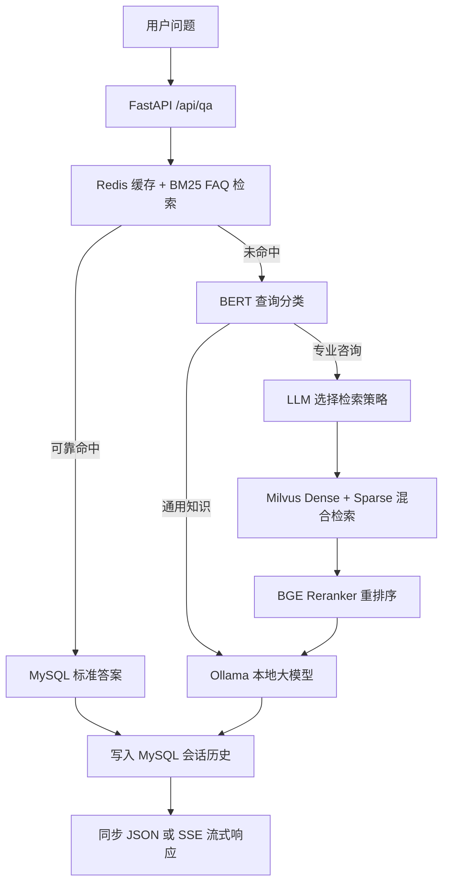

# EduRAG

EduRAG 是一个面向 IT 教育培训场景的智能问答平台。它将高确定性的 FAQ
检索与检索增强生成（RAG）结合：已沉淀的标准问题优先由 MySQL/BM25 返回，
未命中时再从知识库检索上下文并交由本地 Ollama 大模型生成回答。

项目提供 FastAPI API、浏览器聊天界面、流式回答、会话历史持久化、FAQ 管理、
BERT 查询分类，以及从测试集生成到 RAGAS 评估的完整离线评测流程。

## 目录

- [核心能力](#核心能力)
- [技术栈](#技术栈)
- [系统架构](#系统架构)
- [环境要求](#环境要求)
- [快速开始](#快速开始)
- [配置说明](#配置说明)
- [构建知识库与启动 RAG](#构建知识库与启动-rag)
- [运行 Web 服务](#运行-web-服务)
- [API 概览](#api-概览)
- [数据与模型](#数据与模型)
- [测试集生成与质量筛选](#测试集生成与质量筛选)
- [RAGAS 评估](#ragas-评估)
- [测试与排障](#测试与排障)
- [安全与部署建议](#安全与部署建议)
- [项目结构](#项目结构)

## 核心能力

- SQL 优先、RAG 回退：FAQ 先经 Redis 缓存、BM25 和 MySQL 查询；仅在没有
  可靠命中时进入 RAG，兼顾标准答案的稳定性与开放问题的覆盖范围。
- 文档知识库：支持 Markdown、TXT、PDF、DOCX、PPTX、JPG、PNG，采用父子分块
  策略，子块用于召回、父块作为最终上下文。
- 混合检索与重排序：BGE-M3 同时生成 dense/sparse 向量；Milvus 使用加权混合
  检索，随后以 BGE Reranker 对父文档重排序。
- 查询路由：BERT 将查询分为 `general_knowledge` 与
  `professional_consultation`；专业培训咨询执行检索，通用知识直接由 LLM 回答。
- 本地生成与流式输出：通过 OpenAI 兼容接口调用 Ollama，支持 SSE
  `meta → token* → done` 事件流。
- 会话与 FAQ 管理：会话最近 5 轮存入 MySQL；FAQ 管理接口会在写入后失效 Redis
  缓存，避免读取旧内容。
- 可复现评估：Test Sample Agent 生成至少 200 条 JSONL 样本，Critique Agent 按
  可回答性、领域相关性、独立性筛选，再使用 RAGAS 评估检索与回答质量。

## 技术栈

| 领域 | 技术 |
| --- | --- |
| API 与前端 | FastAPI、Uvicorn、原生 HTML/CSS/JavaScript |
| LLM 编排 | LangChain Core、LangChain OpenAI、Ollama（OpenAI 兼容 API） |
| 向量检索 | Milvus、BGE-M3 dense/sparse embedding、BGE Reranker |
| FAQ 检索 | MySQL、Redis、BM25 (`rank-bm25`) |
| 分类与训练 | Transformers、PyTorch、BERT、scikit-learn |
| 评估 | RAGAS 0.3、Test Sample Agent、Critique Agent |
| 文档处理 | PyMuPDF、python-docx、python-pptx、Pillow |

## 系统架构

### 请求流程



### “SQL 优先、RAG 回退”是什么意思？

1. 系统总是先查询 FAQ。问题先进行 BM25 相似度检索，FAQ 问题与分词结果由
   Redis 缓存，可靠命中后再从 MySQL 读取标准答案并直接返回。
2. 若 BM25 分数未达到阈值，SQL 层返回回退标记，系统才调用 RAG。
3. RAG 根据 BERT 分类决定是否检索：通用知识问题直接交给 LLM；IT 培训、课程、
   师资、周期、费用等专业咨询会从 Milvus 检索并使用文档上下文生成回答。

例如，“Python 课程需要学习多久？”通常可命中 FAQ，得到可控的 MySQL 标准答案；
“如何规划机器学习入门路线？”通常没有固定 FAQ，系统会走 RAG 或通用 LLM 路径。

## 环境要求

- Python 3.10+，建议使用项目使用过的 Conda 环境 `edurag`。
- 可访问的 MySQL、Redis 和 Milvus 服务。
- 已启动的 Ollama 服务，以及配置中指定的模型。默认模板使用
  `qwen3.5:4b-mlx`。
- 本地 Hugging Face 模型目录：BERT 基座模型、BGE-M3 embedding 模型、BGE
  Reranker 模型。

Apple Silicon 用户可将 `rag.model_device` 设为 `mps`，由配置传入 BERT、BGE-M3
和 Reranker；不要在代码中硬编码设备。若特定依赖不支持 MPS，可针对该组件在配置中
回退为 `cpu`。

## 快速开始

### 1. 克隆项目并安装依赖

```bash
git clone <your-repository-url>
cd EduRAG

conda activate edurag
pip install -r requirements.txt
```

### 2. 启动依赖服务

请先启动 MySQL、Redis、Milvus 与 Ollama。Ollama 默认地址应与配置中的
`llm.base_url` 对应：`http://localhost:11434/v1`。

```bash
ollama serve
ollama list
```

确保列表中包含配置指定的模型，例如 `qwen3.5:4b-mlx`。首次使用时请通过 Ollama
拉取或导入模型；项目不会自动下载大模型权重。

### 3. 创建本地配置

```bash
cp config.example.yaml config.yaml

export EDURAG_MYSQL_PASSWORD='replace-with-your-password'
export EDURAG_REDIS_PASSWORD='replace-with-your-password'
export EDURAG_ADMIN_TOKEN='replace-with-a-long-random-token'
```

`config.yaml` 是本地部署文件，已被 Git 忽略。不要提交密码、管理员令牌或本地模型的
绝对路径。

### 4. 配置本地模型和设备

编辑 `config.yaml` 的 `rag` 部分，将模型路径调整为本机实际位置。例如 Apple Silicon：

```yaml
rag:
  query_base_model: /absolute/path/to/bert-base-chinese
  query_model_path: core/bert_query_classifier
  query_training_data_path: core/rag/data/finetuning_data.jsonl
  embedding_model_path: /absolute/path/to/bge-m3
  reranker_model_path: /absolute/path/to/bge-reranker-v2-m3
  model_device: mps
  segmenter_device: cpu
```

### 5. 建库并体验命令行 RAG

```bash
python -m core.rag.system
```

该命令会在微调分类器不存在时使用 `query_training_data_path` 训练 BERT，解析
`knowledge_base_path` 下的文档并 upsert 到 Milvus，然后进入交互式问答。输入
`exit` 或 `quit` 退出。

首次建库耗时取决于文档量、模型加载和 Milvus 状态。再次执行会使用稳定文档 ID
upsert，避免同一批次的重复主键。

## 配置说明

配置模板位于 [`config.example.yaml`](config.example.yaml)。配置加载器会将相对路径解析为
相对 `config.yaml` 所在目录的绝对路径；所有安全设置均可被环境变量覆盖，格式为：

```text
EDURAG_<SECTION>_<FIELD>
```

例如：

```bash
export EDURAG_RAG_MODEL_DEVICE=mps
export EDURAG_LLM_MODEL=qwen3.5:4b-mlx
export EDURAG_MILVUS_COLLECTION=edurag_knowledge
```

常用配置项如下。

| 配置项 | 说明 |
| --- | --- |
| `mysql` | FAQ、会话历史的 MySQL 连接信息 |
| `redis` | FAQ 问题、分词与答案缓存的 Redis 连接信息 |
| `milvus` | 向量库地址、数据库与 collection 名称 |
| `llm` | Ollama/OpenAI 兼容端点、模型、温度、最大输出长度与流式开关 |
| `rag.knowledge_base_path` | 待解析的知识库目录 |
| `rag.query_*` | BERT 基座、微调模型与 JSONL 训练集路径 |
| `rag.embedding_model_path` / `reranker_model_path` | BGE-M3 与重排序模型的本地路径 |
| `rag.model_device` | BERT、embedding 与 reranker 使用的设备，如 `mps` 或 `cpu` |
| `eval` | 样本、筛选结果、预测、RAGAS 结果路径以及重试/超时参数 |

`EDURAG_ADMIN_TOKEN` 不写入 YAML，仅从环境变量读取，用于保护 FAQ 写接口。

## 构建知识库与启动 RAG

### 知识库内容

默认知识库目录是 `data/ai_data/`。加载器支持以下格式：

| 类型 | 扩展名 |
| --- | --- |
| 纯文本与 Markdown | `.txt`、`.md` |
| 文档 | `.pdf`、`.docx`、`.pptx` |
| 图片 | `.jpg`、`.png` |

解析时普通中文文本使用递归切分器，Markdown 使用 Markdown 切分器。每个父块被进一步
划分为子块；子块含有 `parent_id` 与 `parent_content` 元数据。Milvus 召回子块后会去重
并还原父块，减少碎片化上下文。

### 检索策略

专业咨询会由 `StrategySelector` 根据问题在以下策略中选择一个：

| 策略 | 适用场景 |
| --- | --- |
| `direct_retrieval` | 目标明确、可直接检索的问题 |
| `hyde_retrieval` | 抽象概念问题，先生成假设性知识片段提高召回 |
| `subquery_retrieval` | 含多个实体、比较项或多个信息需求的问题 |
| `backtracking_retrieval` | 过于具体或实现细节过多、需先泛化的问题 |

检索结果使用 dense 向量和 sparse 向量加权融合；存在多个候选父文档时，BGE Reranker
再次按问题与文档的相关性排序。

## 运行 Web 服务

### 生产模式

```bash
conda activate edurag
python main.py --config config.yaml --host 0.0.0.0 --port 8001
```

浏览器访问 `http://127.0.0.1:8001/`，健康检查地址为
`http://127.0.0.1:8001/health`。

生产模式会初始化 MySQL、Redis、Milvus、模型和 LLM 端点。若关键后端无法初始化，
`/health` 将报告 `degraded`，问答接口返回服务不可用，而不会静默使用伪造答案。

### 演示模式

```bash
python main.py --mock --port 8001
```

演示模式仅用于无后端的 UI/接口演示，使用进程内存中的示例问答，响应来源会标为
`mock`。该模式需要显式 `--mock` 或 `EDURAG_API_MOCK=true`；它不会替代真实服务。

## API 概览

### 问答与会话

| 方法 | 路径 | 说明 |
| --- | --- | --- |
| `POST` | `/api/qa/ask` | 同步问答，返回答案、来源、会话 ID 与历史记录 |
| `POST` | `/api/qa/ask/stream` | SSE 流式问答，事件类型为 `meta`、`token`、`done` 或 `error` |
| `GET` | `/api/qa/sessions/{session_id}/history` | 获取最近会话记录 |
| `DELETE` | `/api/qa/sessions/{session_id}` | 清除会话记录 |
| `GET` | `/health` | 返回 `ready`、`mock`、`error` 状态 |

同步调用示例：

```bash
curl -X POST http://127.0.0.1:8001/api/qa/ask \
  -H 'Content-Type: application/json' \
  -d '{"query":"Java 课程的学习周期是多久？"}'
```

`source` 的可能值为：`sql`（FAQ 命中）、`rag`（RAG/LLM 路径）或 `mock`（演示模式）。

流式接口返回的 `done` 事件包含完整会话历史；时间字段会以 JSON 可序列化的 ISO 格式
返回。

### FAQ 管理

| 方法 | 路径 | 权限 |
| --- | --- | --- |
| `GET` | `/api/faq` | 公开 |
| `GET` | `/api/faq/{faq_id}` | 公开 |
| `POST` | `/api/faq` | Bearer 管理员令牌 |
| `PUT` | `/api/faq/{faq_id}` | Bearer 管理员令牌 |
| `DELETE` | `/api/faq/{faq_id}` | Bearer 管理员令牌 |

```bash
curl -X POST http://127.0.0.1:8001/api/faq \
  -H "Authorization: Bearer $EDURAG_ADMIN_TOKEN" \
  -H 'Content-Type: application/json' \
  -d '{"question":"什么是 RAG？","answer":"RAG 是检索增强生成。"}'
```

FAQ 写入成功后会清理 FAQ Redis 缓存，使下一次检索加载最新数据。

## 数据与模型

### BERT 查询分类

训练数据位于 `core/rag/data/finetuning_data.jsonl`，每行是一个 JSON 对象：

```json
{"query":"Java 课程大纲是什么？","label":"professional_consultation"}
{"query":"什么是 Transformer？","label":"general_knowledge"}
```

标签含义：

- `professional_consultation`：课程、师资、项目、授课形式、周期、费用、报名、就业等
  与 IT 教育培训服务直接相关的问题。
- `general_knowledge`：数学、代码、技术原理与一般知识等不依赖具体培训服务的问题。

训练后模型与 tokenizer 会保存到 `rag.query_model_path`。若从基础 BERT 检查点加载时
出现分类头缺失/新初始化提示，这是尚未微调的正常信号；完成训练后应使用保存的微调目录。

### 评测数据格式

测试样本与筛选结果均为 JSONL，每行包含：

```json
{
  "context":"生成该问题所依据的知识片段",
  "question":"独立可理解的问题",
  "answer":"基于片段的参考答案",
  "source_doc":"源文档路径"
}
```

JSONL 表示“一行一个独立 JSON 对象”，适合断点续跑、流式写入和损坏行隔离；不是将所有
样本包在同一个 JSON 数组中。

## 测试集生成与质量筛选

运行以下命令，会使用配置中的 Ollama 模型从知识库生成最少 200 条样本，并保存断点：

```bash
python -m eval.datasets
```

流程如下：

1. `TestSampleAgent` 根据知识片段生成中文、可独立理解的事实型问答。
2. `CritiqueAgent` 对每条样本给出评分依据后，按 1–5 分评估：
   - **可回答性**：是否能仅凭给定上下文清晰、无歧义地回答；
   - **领域相关性**：是否对 AI、机器学习、NLP、软件开发或 IT 教育培训有价值；
   - **独立性**：问题脱离原始文档后是否仍可理解。
3. 任一维度低于 `eval.quality_threshold`（默认 4）的样本会被剔除。

默认输出由 `eval` 配置控制：

| 文件 | 内容 |
| --- | --- |
| `eval/data/test_samples.jsonl` | 原始生成样本 |
| `eval/data/test_samples_critiqued.jsonl` | 带评分依据、分数与淘汰原因的审查记录 |
| `eval/data/test_samples_filtered.jsonl` | 通过所有质量门槛的样本 |

仓库当前包含一份可复现实例：200 条原始样本经质量筛选后保留 104 条。

## RAGAS 评估

运行：

```bash
python -m eval.rag
```

该命令使用质量筛选后的样本构建与应用一致的 RAG 工作流，记录实际被送入 LLM 的检索
上下文和回答，再用配置中的同一 Ollama 模型进行 RAGAS 评估。当前实现要求
`llm.model=qwen3.5:4b-mlx`，以保证生成、样本审查和评估使用同一模型。

仅满足以下条件的预测会进入 RAGAS：预测未失败、被 BERT 分类为专业咨询，并且实际含有
检索上下文。FAQ 直接命中和通用知识的无检索回答不应混入检索质量指标。

| 指标 | 衡量内容 |
| --- | --- |
| Context Precision | 检索上下文中真正支持参考答案的内容占比，反映召回结果是否冗余 |
| Context Recall | 参考答案所需信息被检索上下文覆盖的程度，反映是否漏召回关键事实 |
| Answer Relevancy | 回答与用户问题的直接相关程度 |
| Faithfulness | 回答是否有检索上下文支持、是否减少无依据生成 |

输出文件：

| 文件 | 内容 |
| --- | --- |
| `eval/data/rag_predictions.jsonl` | 每条测试样本的回答、分类、策略和实际检索上下文 |
| `eval/data/rag_evaluation.jsonl` | 每条合格 RAG 预测的四项 RAGAS 分数 |
| `eval/data/rag_evaluation_summary.json` | 聚合统计结果 |

随仓库提交的示例评估共包含 104 条输入预测，其中 6 条满足检索评估条件。该小样本结果
仅用于验证评测链路，不应作为最终线上效果结论：

| 指标 | 示例均值 |
| --- | --- |
| Context Precision | 0.6667 |
| Context Recall | 0.6667 |
| Answer Relevancy | 0.8396 |
| Faithfulness | 0.9577 |

## 测试与排障

### 自动化测试

在项目根目录运行完整测试集：

```bash
conda run -n edurag python -m pytest -q
```

测试覆盖配置加载、SQL/Redis/BM25、RAG 解析与检索、BERT 分类、SSE 流式 API、FAQ
鉴权、测试集质量筛选和 RAGAS 适配层。

### 常见问题

| 现象 | 排查方式 |
| --- | --- |
| `config file not found` | 执行 `cp config.example.yaml config.yaml`，或通过 `--config` 指定配置路径。 |
| BERT 训练数据找不到 | 检查 `rag.query_training_data_path`；它必须指向逐行 JSONL 文件。 |
| `MPS` 不可用或模型加载失败 | 将 `rag.model_device` 临时设为 `cpu`，确认 PyTorch 与 macOS/PyTorch 版本兼容后再启用 MPS。 |
| Milvus 无检索结果 | 先运行 `python -m core.rag.system` 完成文档解析和向量 upsert，再确认 collection 与 `source_filter` 一致。 |
| API 显示 `degraded` | 查看 `/health` 的 `error` 字段，并依次检查 MySQL、Redis、Milvus、Ollama 与本地模型路径。 |
| FAQ 修改后仍返回旧答案 | 确认写接口返回成功；接口会失效 Redis 缓存，下一次查询会重建检索数据。 |
| 流式连接完成但前端历史未更新 | 检查客户端是否处理 `done` 事件；服务端会以 ISO 格式序列化历史中的时间字段。 |

## 安全与部署建议

- 只提交 [`config.example.yaml`](config.example.yaml)，绝不提交 `config.yaml`、密码、
  管理员令牌或本地模型目录。
- 将 `EDURAG_MYSQL_PASSWORD`、`EDURAG_REDIS_PASSWORD` 与
  `EDURAG_ADMIN_TOKEN` 交由环境变量或部署平台的 Secret Manager 注入。
- FAQ 的写操作必须经 TLS、反向代理和可信的服务端管理工具访问；不要将管理员令牌暴露
  给浏览器。
- 生产环境应以进程管理器运行 Uvicorn，并在前方使用 HTTPS 反向代理；对 MySQL、Redis
  和 Milvus 配置访问控制与持久化备份。
- `--mock` 仅用于开发演示。生产环境出现依赖初始化失败时应修复依赖，不应依赖 mock
  回答。

## 项目结构

```text
EduRAG/
├── api/                    # FastAPI 应用、依赖注入、QA 与 FAQ 路由
├── base/                   # 配置加载与日志配置
├── core/
│   ├── system.py           # SQL 优先、RAG 回退与会话编排
│   ├── sql/                # MySQL、Redis、BM25 FAQ 检索
│   └── rag/                # 文档解析、向量库、分类、检索策略、LLM
├── data/
│   ├── ai_data/            # 知识库源文档
│   └── subject_knowledge_qa.csv  # FAQ 初始化数据
├── eval/                   # 样本生成、Critique、RAGAS 评估与 JSONL 产物
├── tests/                  # 单元与接口测试
├── web/                    # 浏览器聊天界面
├── config.example.yaml     # 安全配置模板
├── main.py                 # Web 服务启动入口
└── requirements.txt        # Python 依赖
```

## License

本项目采用 [MIT License](LICENSE)。
